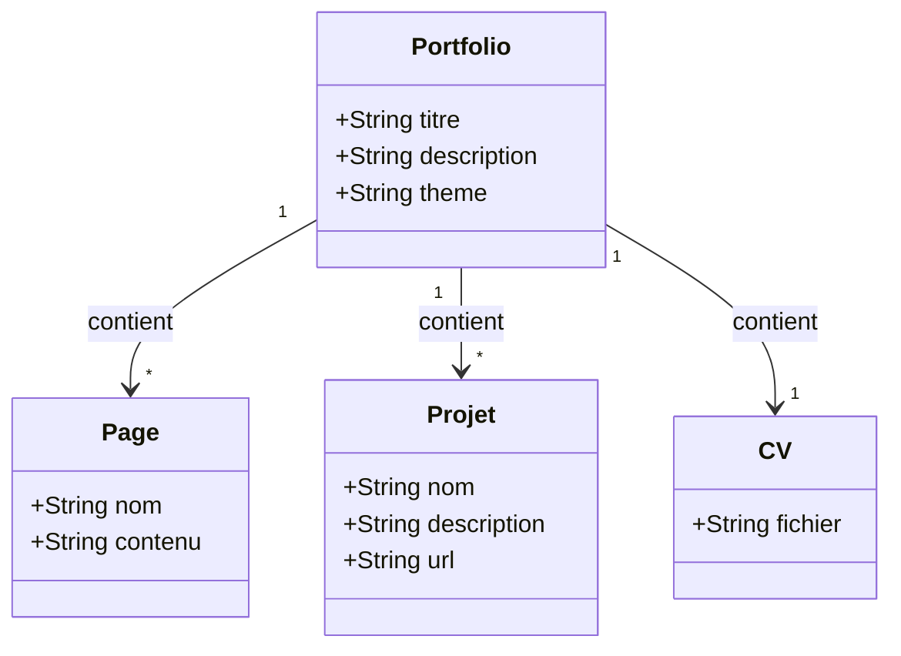
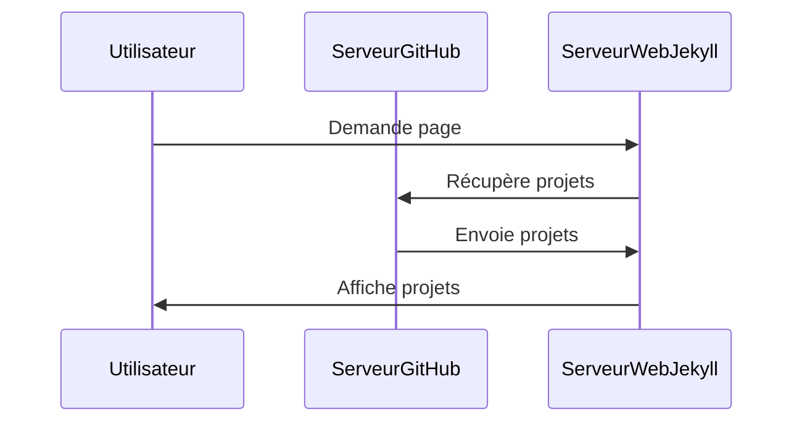

# Bienvenue sur mon Portfolio

Bienvenue dans mon portfolio ! Retrouvez ici mes projets, mon parcours et mes informations de contact.

---

## Navigation
- [À propos](about.md)
- [Contact](contact.md)

---

## Diagramme de classe

## Diagramme de séquence

